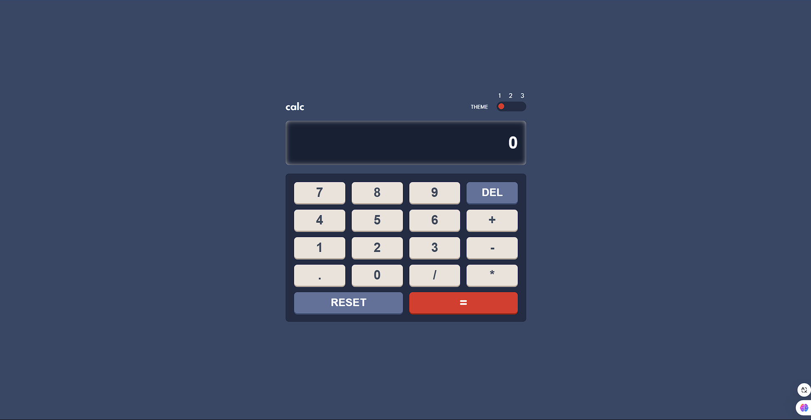

# Frontend Mentor - Calculator app solution

This is a solution to the [Calculator app challenge on Frontend Mentor](https://www.frontendmentor.io/challenges/calculator-app-9lteq5N29)

### Screenshot

### Links

- Solution URL: [here](https://www.frontendmentor.io/solutions/calculator-app-solution-P8FZDUGDDC)
- Live Site URL: [here](https://sunilbaghel002.github.io/calculator-app-solution/)

## My process

### Built with

- Semantic HTML5 markup
- CSS custom properties
- CSS Variables
- CSS Grid
- CSS Media Queries
- Basic JS
- DOM multiplation
- Js Functions

# 🚀🚀🚀